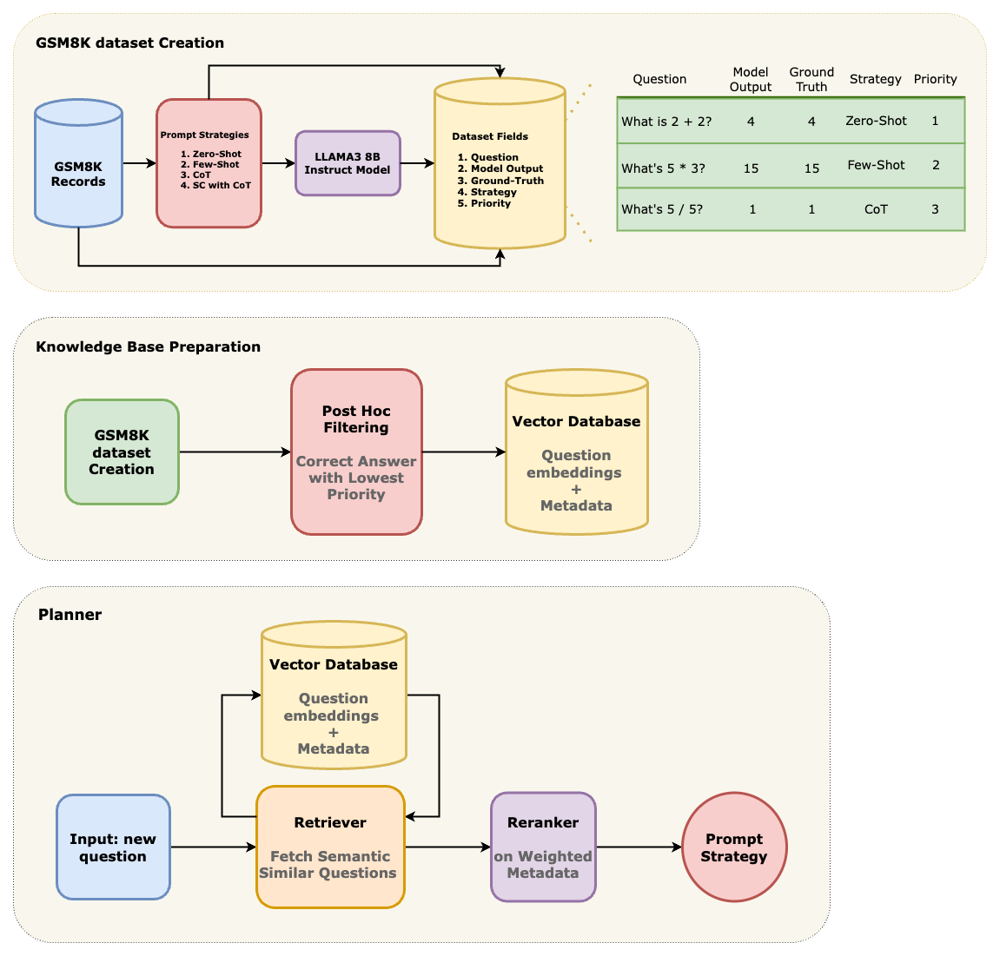

# Autonomous Prompt Optimization for Large Language Models (LLMs)

This project aims to build an autonomous system to optimize prompt generation for Large Language Models (LLMs), enhancing performance across tasks by balancing generality and specificity. By automating the creation and selection of diverse, high-quality prompts, this system seeks to reduce manual intervention and maximize LLM utility across various applications.

**Proposal Document**: [Link to Proposal](https://docs.google.com/document/d/1NuH-juFnK-06XQE0cOYiUpV2loC1j3ePd4-OfXM7r2A/edit)

---

## Project Outline

**Approach**


**Directory Structure**
```
autonomous-prompting/
├── .github/                # GitHub workflows and configurations
├── auto-cot/               # Code and resources for Chain-of-Thought and Auto-CoT models
├── data/                   # Raw and processed datasets
├── docs/                   # Project documentation and markdown guides
├── src/                    # Core code for prompt generation, retrieval, agents, etc.
│   ├── strategies/         # Code for each prompt strategy (e.g., Zero-Shot, Few-Shot, CoT)
│   │   ├── prompt_templates.yaml # 4 prompt templates
|   |   |-- load_prompt_template.py # load prompt based on given strategy

│   ├── retrieval/          # Code for the retriever and re-ranker functions
│   │   ├── generate_embeddings.py
│   │   └── retrieve_rerank.py
│   ├── agents/             # Code for planner and executor agents
│   │   ├── planner.py
│   │   └── executor.py
│   └── dataModel/          # Pydantic data model of our dataset
|   |   script/
│       └── create_gsm8k_dataset.py # Script to create the dataset/

├── notebooks/              # Jupyter notebooks for experiments and analysis
├── .gitmodules             # Git submodules, if any
├── LICENSE                 # License for the project
└── README.md               # Overview of the project

```

**Step 1: Initial Setup + Data Preparation** (@Saharsh1005) :
- [x] Task 1.1: Chore: initial project `repo/subdir-setup/ PR-template` setup
- [x] Task 1.2: Define a prompt structure template (`src/strategies/prompt_templates.yaml`) for each strategy (Zero-Shot, Few-Shot, CoT, Auto-CoT).
- [x] Task 1.3: Write a script (`src/strategies/load_prompt_template.py`) to dynamically load and format prompt structures from the YAML file.

**Step 2: Create GSM8k dataset (part 1)** (@Saharsh1005) :
- [x] Task 2.1: Create a pydantic dataModel comprising of question, prompt, prompt-strategy, answer. (location: `src/dataModel/gsm8k_data_model.py` )
- [x] Task 2.2: feat: Script to create gsm8k dataset (1000questions*4prompts-per-question --> 4000 records in dataset) (location: `src/scripts/create_gsm8k_dataset.py`)
- [x] Task 2.3: Create dataset by running the script (location `data/gsm8k_1k.json`)

## Group members
- Ishaan Singh: is14@illinois.edu
- Henry Yi: weigang2@illinois.edu
- Saharsh Barve: ssbarve2@illinois.edu
- Veda Kailasam: vedak2@illinois.edu

--- 

**Contributions and Future Work**: This project will contribute to automating prompt engineering for LLMs, promoting scalability, and improving LLM performance across diverse applications. Future directions may include real-time prompt adjustment based on task complexity.
