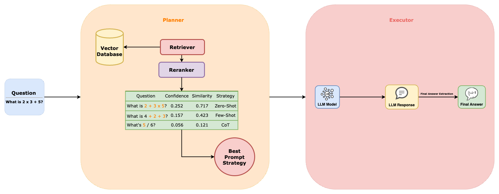

# Dynamic Prompting: Autonomous Prompt Selection for LLMs

This project introduces a Dynamic Prompt Selection pipeline that automates the process of creating, evaluating, and selecting optimal prompts for Large Language Models (LLMs). Our approach addresses existing limitations in prompt engineering, such as operational inefficiencies, computational costs, and context-dependent performance.

**Proposal Document**: [Link to Proposal](https://docs.google.com/document/d/1NuH-juFnK-06XQE0cOYiUpV2loC1j3ePd4-OfXM7r2A/edit)

**Project Slides**: ([data/CS598-TZ Final Prez_ Dynamic Prompting.pdf](https://github.com/Saharsh1005/autonomous-prompting/blob/main/data/CS598-TZ%20Final%20Prez_%20Dynamic%20Prompting.pdf))

## Authors
Henry Yi, Ishaan Singh, Saharsh Barve, Veda Kailasam

## Key Components

1. **Dataset Generation**: We created a dataset based on GSM8K, generating variations of each question using four strategies: Zero-shot, Few-shot, Chain of Thought (CoT), and Self-Consistency Chain of Thought (SC-CoT).

2. **Planner**: This component prepares the knowledge base by embedding questions, retrieving similar questions, and selecting the optimal strategy based on confidence scores.

3. **Executor**: The operational core of the framework, executing prompts using the selected strategy and parsing the output to extract the final answer.

## Framework

## Results

### Comparison of AutoPrompt vs COT vs Self-Consistency-COT

| Strategy | Accuracy | Avg Tokens Per Question | Average Runtime Per Question (seconds) |
|----------|----------|-------------------------|----------------------------------------|
| **AutoPrompt** | **89%** | **399.03** | **3.21** |
| COT | 79% | 489.06 | 3.86 |
| Self-Consistency (w/ COT) | 88% | 2445.3 | 16.78 |

## Key Findings

- AutoPrompt achieves superior accuracy while using 5x fewer tokens than SC-CoT and running 5x faster.
- Dynamic strategy selection outperforms static approaches, matching SC-COT's accuracy while maintaining computational efficiency.
- The system successfully addresses the accuracy-efficiency tradeoff, improving accuracy by 10% over base CoT while reducing token usage by 18%.

## Future Work

- Implement reinforcement learning for real-time strategy adaptation
- Develop user feedback mechanisms for continuous system improvement
- Extend the framework to broader task domains beyond mathematical reasoning

## References

1. [Prompt Engineering Guide](https://www.promptingguide.ai/)
2. [Lilian Weng's Blog on Prompt Engineering](https://lilianweng.github.io/posts/2023-03-15-prompt-engineering/)
